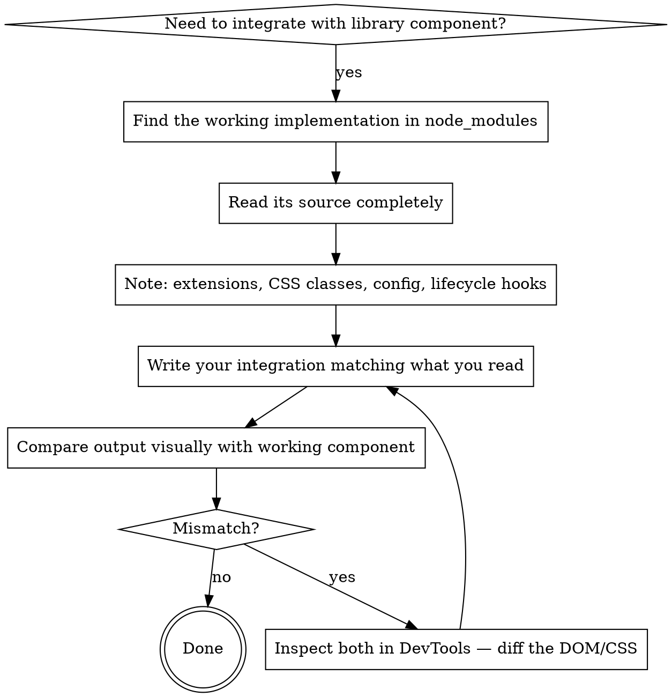

# Source-First Integration

## The Rule

**Read the source of the working implementation BEFORE writing integration code.**

Do not guess at library APIs, CSS class names, extension lists, or configuration options. Every integration bug in this project has been caused by assuming instead of reading.

## When to Use

- Building a new NodeView that should match Crepe's existing ones
- Adding a CodeMirror instance that should look like existing code blocks
- Configuring a third-party library (mermaid, etc.) with custom options
- Adding CSS for a component that should match library-styled siblings
- Registering plugins with Milkdown's lifecycle

## The Process



## Concrete Steps

### 1. Find the working implementation

```bash
# Find where Crepe defines its CodeMirror code blocks:
find node_modules/@milkdown/crepe/src -name '*.ts' | grep -i code

# Find the actual NodeView class:
find node_modules/@milkdown/components/src -name '*.ts' -path '*code-block*'
```

### 2. Read and note what it uses

For Crepe's CodeMirrorBlock, the key findings were:
- Uses `basicSetup` from `codemirror` package (line numbers, bracket matching)
- Uses `drawSelection()` from `@codemirror/view`
- Uses `keymap.of(defaultKeymap.concat(indentWithTab))`
- Wraps in Vue component with class `milkdown-code-block`
- Does NOT set its own CSS background — Crepe's theme CSS handles it

### 3. Match it, don't reinvent it

Use the same packages, extensions, and patterns. Don't roll a minimal version.

### 4. Don't add CSS overrides for things the library handles

If the library sets backgrounds, fonts, or colors via its own theme system, don't override them with your own CSS. Your overrides will break when the theme changes.

## Red Flags

These thoughts mean STOP — you're about to guess:

| Thought | What to do instead |
|---------|--------------------|
| "I think the API takes..." | Read the source or type definitions |
| "This should work with..." | Read the docs, or test in isolation first |
| "I'll add a CSS override to match" | Check if the library already styles it |
| "I'll use a minimal setup" | Check what the working implementation uses |
| "The config option probably does..." | Read the implementation that consumes it |
| "I'll roll my own because it's simpler" | It won't match. Use what the library uses. |

## Milkdown-Specific Patterns

These are proven correct for this project:

- **Registering remark plugins:** Use `$remark()` from `@milkdown/utils`, not `ctx.update(remarkPluginsCtx, ...)` — Crepe overwrites the context during init
- **`$node()` return value:** Returns `$Node` directly. Pass to `$view()` as-is, not `.node`
- **`$view()` first argument:** Expects a `$Node` or `$Mark` with `.type(ctx)` method and `.id` property
- **CodeMirror in NodeViews:** Use `basicSetup` from `codemirror` + `drawSelection()` — same as Crepe's `CodeMirrorBlock`
- **Mermaid theme config:** `themeVariables` only works with `theme: "base"`. Other themes silently ignore custom variables.

## The Cost of Guessing

From a single feature (mermaid diagrams), guessing caused 5 bugs that each required user intervention:

1. Remark plugin silently not running (guessed registration API)
2. `type.type is not a function` (guessed `$node()` return shape)
3. Theme variables silently ignored (guessed mermaid config behavior)
4. Missing line numbers and wrong theme (guessed CodeMirror extensions)
5. Wrong background color (added CSS override instead of using library theme)

Each was fixed in minutes by reading the actual source. Each wasted the user's time because we guessed first.
