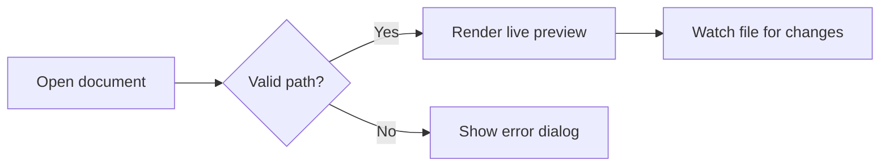
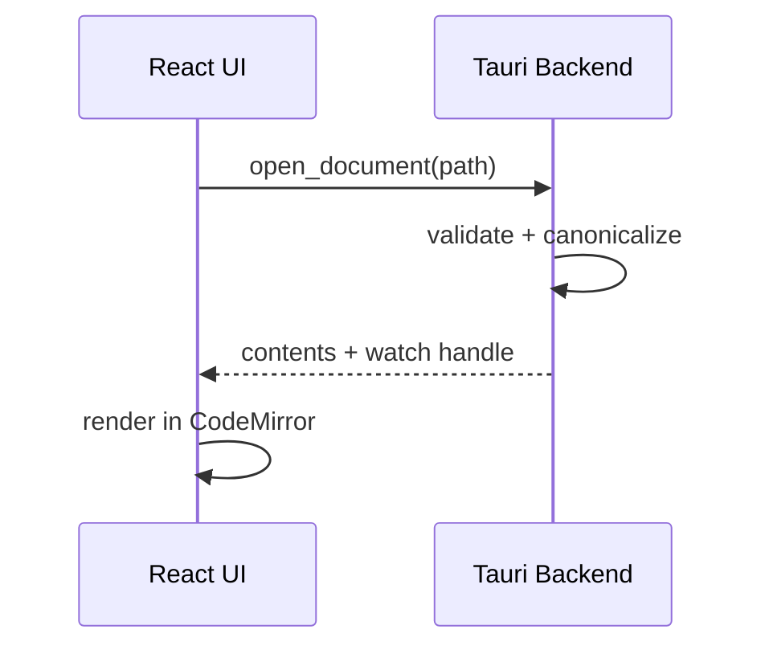

# Heading Level 1

Lorem ipsum dolor sit amet, consectetur adipiscing elit. This paragraph
exercises **bold text**, *italic text*, ***bold italic***, ~~strikethrough~~,
and `inline code`. Unsupported syntax should stay literal: ==highlight== is
not a ProseMark extension yet. Escaped characters should also stay
literal: \*not emphasis\*, \`not code\`, \# not a heading.

## Heading Level 2

Sed do eiusmod tempor incididunt ut labore. Here is an [inline link](https://example.com),
a [link with a title](https://example.com "Hover title"), and a bare autolink:
https://example.com/autolink. An emoji shortcode: :sparkles: and a literal one: 🎉

### Heading Level 3

A hard line break follows this line (two trailing spaces):  
this line should render directly beneath it, same paragraph.

#### Heading Level 4

##### Heading Level 5

###### Heading Level 6

---

## Lists

### Unordered

- Lorem ipsum dolor sit amet
- Consectetur adipiscing elit
  - Nested item with `inline code`
  - Nested item with **bold**
    - Third level, just to be sure
- Ut enim ad minim veniam

### Ordered

1. First item
2. Second item
   1. Nested ordered item
   2. Another nested item
3. Third item, starting a paragraph continuation:

   This paragraph belongs to item three and should indent with it.

### Tasks

- [ ] Unchecked task: quis nostrud exercitation
- [x] Checked task: ullamco laboris nisi
- [ ] Task with **bold**, *italic*, and a [link](https://example.com)
  - [x] Nested checked task
  - [ ] Nested unchecked task

## Blockquotes

> Duis aute irure dolor in reprehenderit in voluptate velit esse cillum.
>
> > Nested blockquote: excepteur sint occaecat cupidatat non proident.
>
> Back to the outer quote, with a trailing **bold** flourish.

## Code

Inline code sits above; this is a fenced block with a language:

```typescript
interface SpotCheck {
  name: string;
  passed: boolean;
}

function check(item: SpotCheck): string {
  return item.passed ? `✓ ${item.name}` : `✗ ${item.name}`;
}
```

And a plain fence with no language:

```
plain preformatted text
  with indentation preserved
```

## Tables

| Feature       | Status      | Notes                              |
| :------------ | :---------: | ---------------------------------: |
| Headers       | ✅ Done     | Levels one through six             |
| **Emphasis**  | ✅ Done     | Bold, *italic*, ~~strike~~         |
| `Code`        | ✅ Done     | Inline and fenced                  |
| Alignment     | ✅ Done     | Left, center, and right columns    |

## Math

Inline math: the identity $e^{i\pi} + 1 = 0$ sits mid-sentence.

Block math:

$$
\int_{-\infty}^{\infty} e^{-x^2} \, dx = \sqrt{\pi}
$$

## Mermaid

### Flowchart



### Sequence Diagram



## Images

A relative image reference (broken here on purpose, checks the fallback):


## Horizontal Rules

Three styles, all should render as rules:

---

***

___

## The End

Final paragraph after the last rule, so nothing above gets swallowed at EOF.
